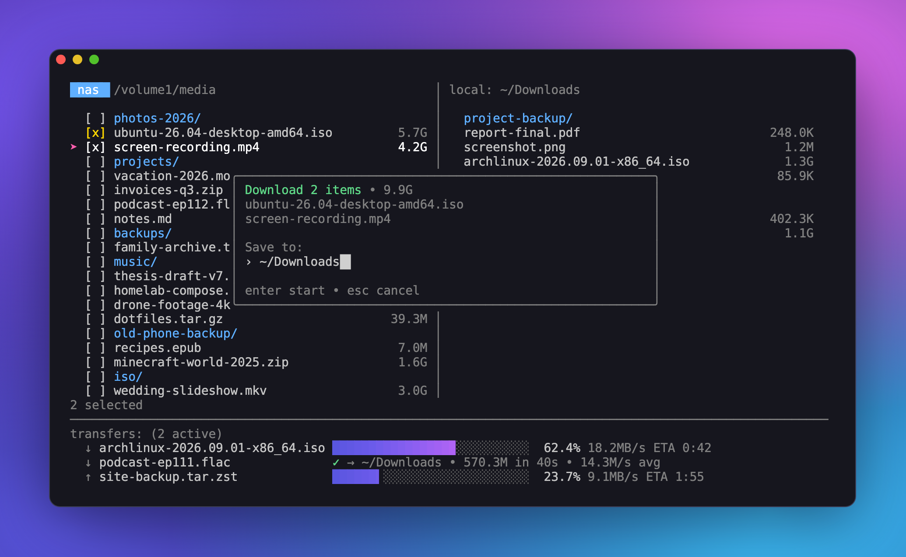

# rtr

[](https://github.com/rjayasin/rtr/actions/workflows/ci.yml)

A terminal UI for copying files over SSH. Save hosts as bookmarks, browse them
over SFTP, and download or upload files with `rsync`. The `rsync` command and its
flags are configurable. Transfers run in the background, so you can keep
browsing while they finish.



## Install

rtr needs `rsync` and `ssh` on your `PATH`.

Download a prebuilt binary for your OS/arch from the
[latest release](https://github.com/rjayasin/rtr/releases/latest), or build from
source (requires Go 1.23+):

```sh
go install github.com/rjayasin/rtr@latest
# or, from a clone:
make build && ./rtr
```

## Usage

```sh
rtr                      # launch the TUI
rtr config               # open the config file in $EDITOR (creating it if needed)
rtr --config-path        # print where the config lives
rtr update               # update to the latest release
rtr version              # print the version
```

### Keys

| Screen     | Keys |
|------------|------|
| Bookmarks  | `↑/↓` move<br>`enter` connect<br>`n` new<br>`e` edit<br>`d` delete<br>`tab` focus transfers<br>`?` toggle keyboard tips (hidden by default)<br>`q` quit |
| Browser    | `↑/↓` move<br>`→` open dir<br>`←` up<br>`x`/`space` select (checkboxes appear once something is selected)<br>`a` all<br>`c` clear<br>`/` search<br>`l` toggle local pane<br>`~` toggle compare<br>`t` sort by time (toggle newest/oldest)<br>`n` sort by name (toggle A→Z/Z→A)<br>`.` toggle hidden files<br>`enter` download<br>`tab`/`shift+tab` switch pane (forward/back)<br>`?` toggle keyboard tips (hidden by default)<br>`r` refresh<br>`esc` disconnect (or clear filter/selection first) |
| Search (`/`) | type to filter by name (case-insensitive, matches anywhere)<br>`enter` accept and return to the list<br>`esc` clear |
| Compare (`~`) | with the local pane open, dims files that exist in **both** panes and moves them to the bottom of each pane, below the files that exist in only one; each group keeps the pane's sort order |
| Transfers (`tab`) | `↑/↓` select<br>`c` cancel highlighted<br>`x` clear finished<br>`tab`/`esc` back |

rtr records in-progress downloads and uploads in `transfers.json`, next to the
config file. If you quit or rtr is interrupted, it resumes them on the next
launch.

## Configuration

The config file is `$XDG_CONFIG_HOME/rtr/config.toml` (default
`~/.config/rtr/config.toml`). rtr creates it on first run and saves bookmarks
you add in the UI to it.

```toml
[rsync]
  binary = "rsync"
  flags  = ["-a", "-z", "--partial", "--human-readable"]
  extra_args = ["--exclude", ".DS_Store"]   # appended verbatim

[[bookmarks]]
  name        = "nas"
  user        = "me"
  host        = "nas.local"
  port        = 2222
  remote_path = "/volume1/media"            # starting directory when browsing
  identity    = "~/.ssh/id_ed25519"         # optional
  jump_host   = "me@bastion:22"             # optional ProxyJump

[[bookmarks]]
  name      = "box"
  ssh_alias = "box"   # inherit HostName/User/Port/IdentityFile from ~/.ssh/config
```

For authentication, rtr tries `ssh-agent` first, then the bookmark's identity
file, then the default keys `~/.ssh/id_{ed25519,ecdsa,rsa}`. It checks host keys
against `~/.ssh/known_hosts`: it trusts an unknown host the first time you
connect and rejects a host whose key has changed.

## Updating

If you installed a release binary, rtr can replace itself with the latest
release:

```sh
rtr update    # fetch the latest release and replace the running binary
```

At startup, rtr checks for a newer release and shows a notice on the bookmarks
screen if there is one. Set `RTR_NO_UPDATE_CHECK=1` to turn the check off.
Builds from source never show the notice, because their version isn't a release
number; run `rtr update` to switch to the latest release.

## Development

```sh
make          # compile and launch rtr
make test     # run the test suite
make vet      # run go vet
make fmt      # format all Go sources
make screenshot  # re-render docs/screenshot.png (fabricated data; needs Chrome)
```

### Releases

Every push to `main` publishes a release. The release workflow picks the new
version from the [Conventional Commit](https://www.conventionalcommits.org)
prefixes since the last tag: `feat:` bumps the minor version, `fix:` bumps the
patch version, and a `!` after the type (e.g. `feat!:`) or a `BREAKING CHANGE:`
footer bumps the major version. Commits without a recognized prefix get a patch
release.

## Why does this project exist
I wanted the ease of navigation you get from an SFTP browser with the speed of rsync. 

## License

MIT. See [LICENSE](LICENSE).
